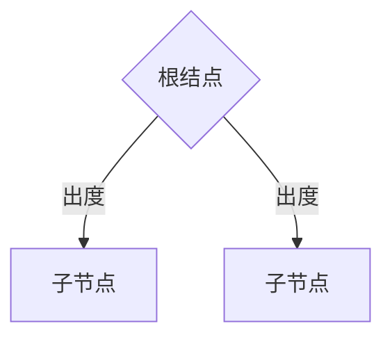

# 关联式容器

​	标准的STL关联式容器分为set(集合)和map(映射表)两大类，以及两大类的衍生体multiset(多键集合)和multimap(多键映射表)，底层机制均以RB-tree完成。RB-tree也是一个独立容器，不开放外界使用。

​	SGI STL提供不在标准之内的关联式容器，hash table(散列表)，以及由此产生的hash_set(散列集合)、hash_map(散列映射表)、hash_multiset(散列多键集合)、hash_multimap(散列多键映射表)。

​	关联式容器观念上类似关联式数据库，其中保存的数据以键值对形式存在，当元素被插入到关联式容器中时，容器内部依照键值大小，以某种特定规则将元素放于适当位置，**关联式容器没有头尾**，只有最大最小，所以没有push_back()、push_front()、pop_back()、pop_front()、begin()、end()这样的行为。

​	一般关联式容器内部是一个balanced binary tree(平衡二叉树)，以获得良好的搜索效率。平衡二叉树有AVL-tree、RB-tree、AA-tree，其中最被广泛使用的是RB-tree。

## 树的特性

​	二叉树有些基本特性，除了根结点，节点和叶子的概念外，有度的概念。



​	根结点有两个出度，子节点有一个入度和两个出度。运用此原理可以判断是否是个二叉树。

​	节点的深度是指根结点到该结点的唯一路径的边的个数。最深子节点的深度称为树的高度。

​	任何节点的大小为他所有子节点的个数包括自己。

## 二叉搜索树

​	二叉搜索树可提供对数时间的元素访问。二叉搜索树的节点放置规则是：任何节点的键值一定大于左节点的每一个键值，并小于右子节点的每个键值。


## 平衡二叉搜索树

​	因为一些插入或删除操作，使得二叉树不再平衡，导致搜索性能下降。


​	平衡的含义在于，没有任何一个节点过深。有数种结构如AVL-tree，RB-tree，AA-tree可实现出平衡二叉搜索树，他们比一般二叉搜索树复杂，因此插入和删除节点的平均时间较长，但是可以应对最坏情况，因此总体平均时间可以节省25%。

## AVL树

​	AVL树的规则要求任何子树的左右节点的深度至多相差1。因此在插入某些元素使得AVL树的条件不再满足的时候，需要调整树的结构。

​	根据AVL树的实现，当插入一个元素使得不平衡的时候，只会有四种情况。

- 左左
- 左右
- 右左
- 右右


​	这四种情况，分为两类，分别可以通过单旋转和双旋转解决。

单旋转


双旋转


## RB-tree

​	RB-tree是SGI STL选择的关联式容器的默认底层实现，是我们的重点。

​	RB-tree在二叉搜索树的基础上，必须满足以下规则：

- 每个节点不是红色就是黑色
- 根结点为黑色
- 如果节点为红，子节点必须为黑
- 任意节点到NULL(树尾端)的任何路径，所含黑色节点树必须一致。


## RB-tree插入的不平衡状态

​	RB-tree插入新元素引起整个RB-tree的不平衡有四种典型的情况。

​	首先，虽然RB-tree要求黑节点的深度要一致，但是也不可能一一计算深度。RB-tree保持平衡是在已经平衡的情况下，考虑新进元素再将整个树配平衡，增量的思想。

​	一般考虑局部的树平衡状态，涉及到三级，插入元素记为X，是最低一层，父节点为P，父亲的兄弟节点为S，祖父节点为G，插入时一般将新元素作为红色节点处理。

- 状况1：S为黑且X为外侧插入，对此情况，我们先对P，G作一次单旋转，并更改P，G颜色，即可满足红黑树规则，红节点的父节点为黑。

  

- 状况2：S为黑且X为内侧插入，对此情况，我们先对P，X作一次单旋转，并更改G，X颜色，红节点的父节点为黑，再将结果对G做一次单旋转，即可满足红黑树规则。

  

- 状况3：S为红且X为外侧插入，对此情况，我们先对P，G作一次单旋转，并更改X颜色，如果GG为黑，完成。

  

- 状况4：S为红且X为外侧插入，对此情况，我们先对P，G作一次单旋转，并更改X颜色，如果GG为红，继续迭代。***为了减少该步骤的不确定复杂度，一般会对插入节点三层进行预处理，若节点的子节点都为红，则更改本节点为红，子节点为黑。

  

## RB-tree Iterator

​	SGI将RB-tree迭代器设计为两层。

```C++
//基层迭代器
struct __rb_tree_base_iterator{
    typedef	__rb_tree_node_base::base_ptr	base_ptr;
    typedef	bidirectional_iterator_tag	iterator_category;
    typedef	ptrdiff_t	difference_type;
    base_ptr			node;//连接容器
    void increment(){//需要考虑根结点的情况
    }
    void decrement(){
        //同样考虑根结点，RB-tree设计header作为根结点的互为父节点
    }
}
//正规迭代器
template <class Value,class Ref,class Ptr>
    struct __rb_tree_iterator:public __rb_tree_base_iterator{
        typedef	Value	value_type;
        typedef	Ref		reference;
        typedef	Ptr		pointer;
        typedef	__rb_tree_iterator<Value,Value&,Value*>	iterator;
        typedef	__rb_tree_iterator<Value,const Value&,const Value*>	const_iterator;
        typedef	__rb_tree_iterator<Value,Ref,Ptr>	self;
        typedef	rb_tree_node<Value>* link_type;
        reference	operator	*(){...}
        pointer	operator	->(){...}
        self&	operator	++(){...}
        self	operator	++(int){...}
        self&	operator	--(){...}
        self	operator	--(int){...}
    }
```

##  RB-tree结构


```C++
typedef bool __rb_tree_color_type;
const	__rb_tree_color_type __rb_tree_red=false;
const	__rb_tree_color_type __rb_tree_black=true;//红色为0黑色为1
struct __rb_tree_node_base{
    typedef	__rb_tree_color_type	color_type;
    typedef __rb_tree_node_base*	base_ptr;
    color_type	color;//颜色
    base_ptr	parent;//父节点
    base_ptr	left;//左节点
    base_ptr	right;//右节点
}
template <class Value>
    struct	__rb_tree_node:public __rb_tree_node_base{
    	typedef	__tb_tree_node<Value>*	link_type;
        Value	value_field;
    }
//真正的树结构
template <class Key,class Value,class KeyOfValue,class Compare,class Alloc=alloc>
    class rb_tree{
    protected:
        typedef	void* void_pointer;
        typedef	__rb_tree_node_base*	base_ptr;
        typedef	__rb_tree_node<Value>	rb_tree_node;
        typedef	simple_alloc<rb_tree_node,Alloc>	rb_tree_node_allocator;
        typedef	__rb_tree_color_type	color_type;
    public:
        typedef Key key_type;
        typedef	Value value_type;
        typedef	Value_type* pointer;
        typedef	const value_type*	const_pointer;
        typedef	value_type&	reference;
        typedef	const value_type& const_reference;
        typedef rb_tree_node* link_type;
        typedef	size_t	size_type;
        typedef	ptrdiff_t	difference_type;
    protected:
        size_type	node_count;//计数
        link_type	header;//根结点的头节点，和根结点互为父节点
        Compare		key_cpmpare;//键值大小比较规则，诗歌function object
        link_type& root()const{return (link_type&)header->parent;}
        link_type& leftmost()const{return (link_type&)header->left;}
        link_type&	rightmost()const{return (link_type&)header->right;}//用来快速存取根结点
        //些静态函数用来快速存取节点的左右节点颜色等，类似
        static link_type&	left(link_type x){...}
        static link_type&	right(link_type x){...}
        static link_type&	parent(link_type x){...}
        static link_type&	value(link_type x){...}
        static link_type&	key(link_type x){...}
        static link_type&	color(link_type x){...}
        static link_type&	left(base_ptr x){...}
    public:
        typedef	__rb_tree_iterator<value_type,reference,pointer> iterator;
    }
```

## Set

