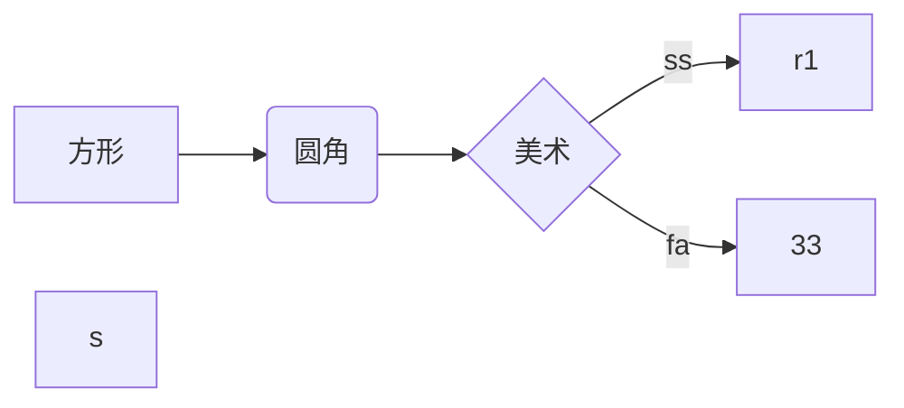

# Markdown语法画流程图

## 开头

​	开头以三个在TAB键上方的点开始，后跟mermaid

## GRAPH头

​	在mermaid后可选择多种模式，打上graph后，接下来的语法才可解析

## 方向

​	图可以是横向和竖向，默认是竖向(TD)，接LR表示横向

## 图表示

​	方形后面接方括号[]里面填写内容，圆角用小括号()，菱形为大括号{}，-->表示箭头，箭头后增加||，||中间表示条件，可在线中间加跳转条件。



## 标准流程图源码表示

​	同样三个点开头，后面接flow，回车

​	st==>start:开始框

​	op=>operation:处理框

​	cond=>condition:判断框，菱形

​	sub1=>subroutine:子流程

​	io=>inputoutput:输入输出框

​	e=>end:结束框

​	st->op->cond

​	cond(yes)->io->e

​	cond(no)->sub1(right)->op

​	后接三个点

​	与图类似，前面表示变量名，加=>后接框类型加:加空格表示框内文字

​	条件 后加(yes/no)表示分支，上面先声明，最后在连接起来。

​	最后连接时对应模块后增加括号()中写方向，表示出线的方向。

```flow
st=>start: what
op=>operation: op
cond=>condition: cond
sub=>subroutine: sub
io=>inputoutput: io
e=>end: ed
st->op->cond
cond(yes)->io->e
cond(no)->sub(right)->op

```


